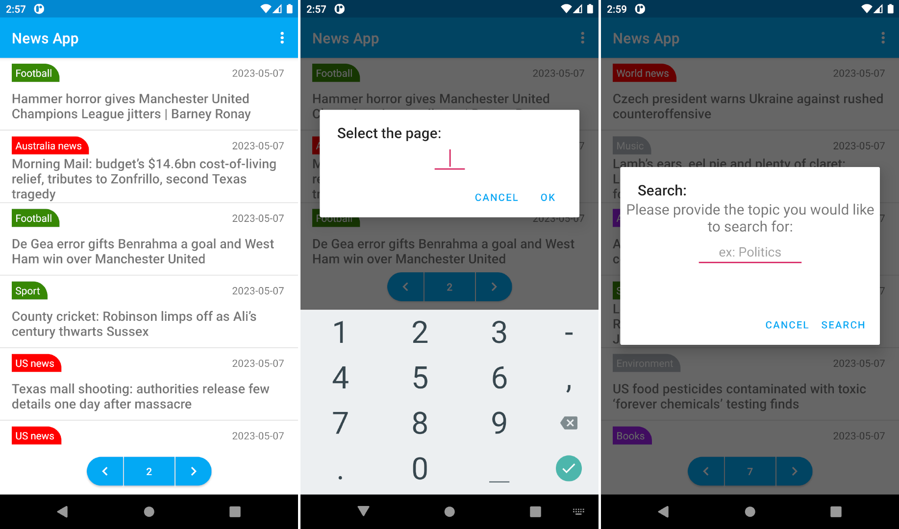

## News App - Using The Guardian test API - Udacity Graduation Project 

### Project Overview

This app displays the latest news headlines posted by The Guardian and offers a link to open the article on the The Guardian website.

The API provides 10 articles per JSON response so only 10 headlines are displayed at once but I implemented the necessary code to allow switching from one page to another aswell as a manual input page selector. Also Users can search headlines by the topic of their interest.

### Screenshots

